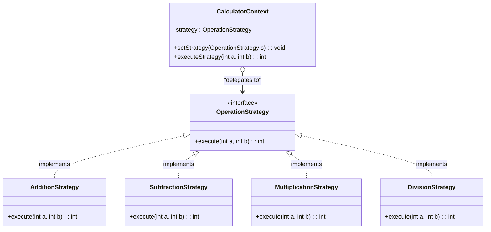
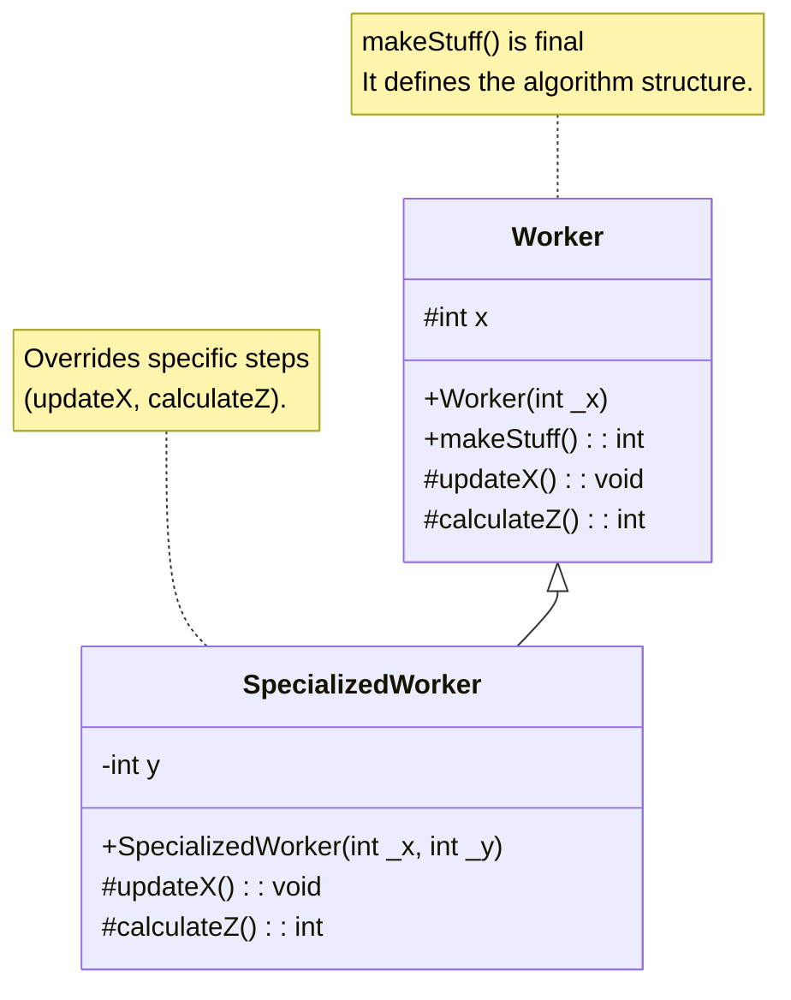
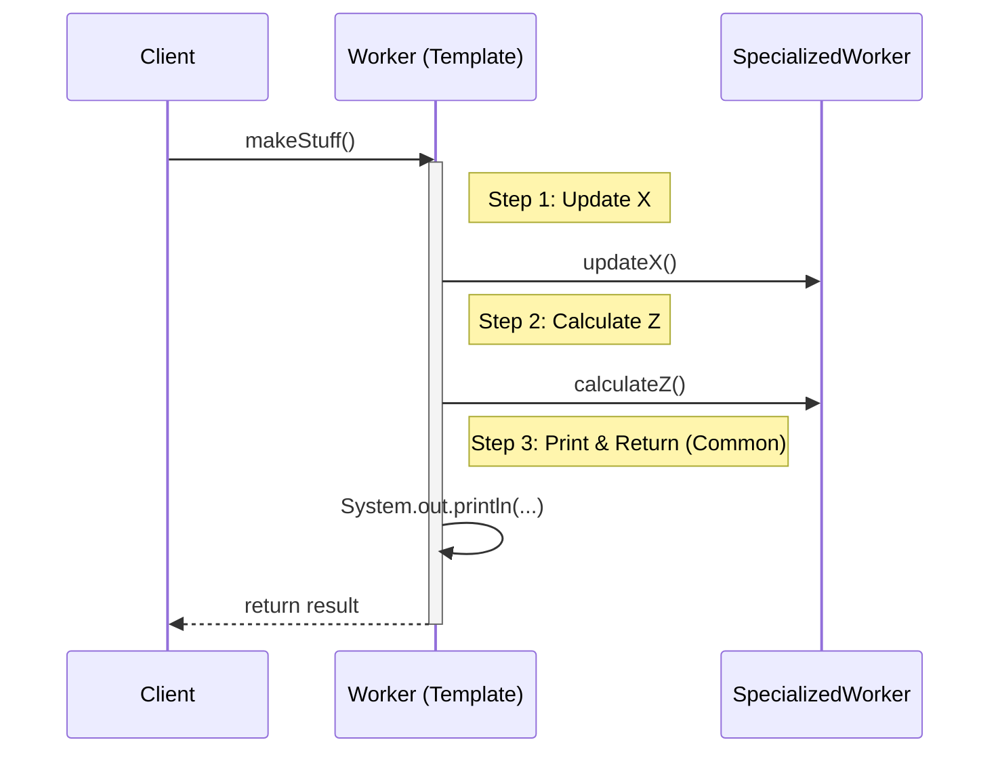
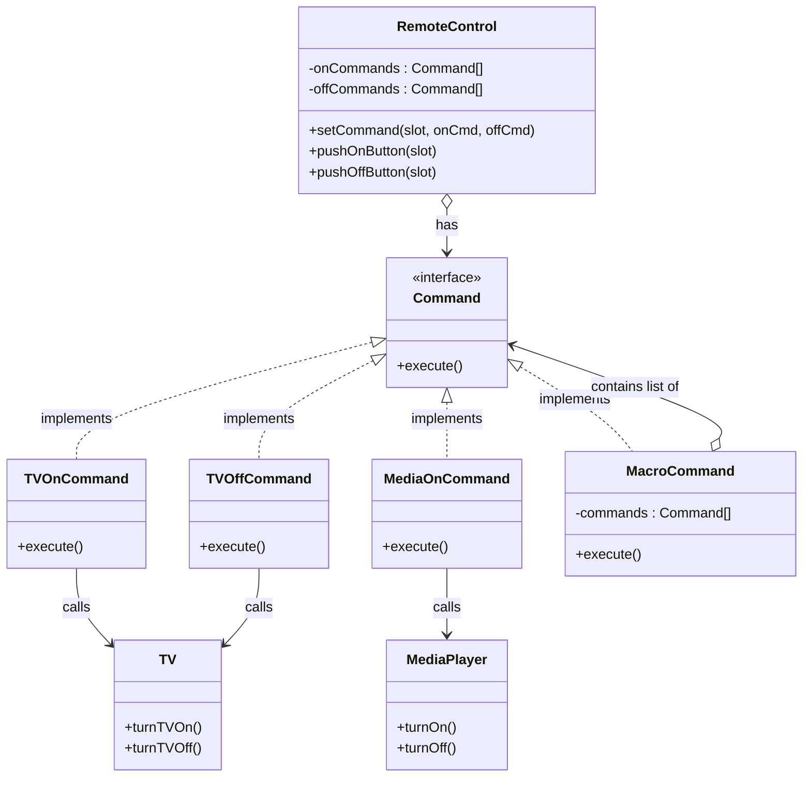
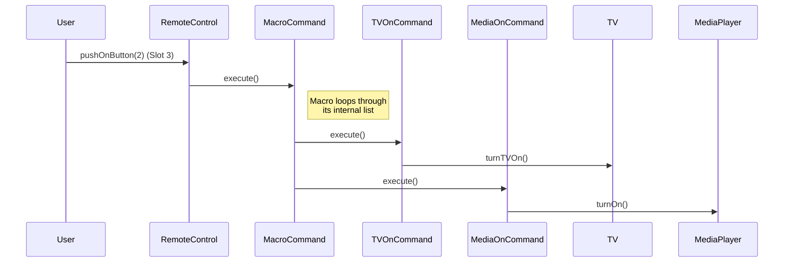
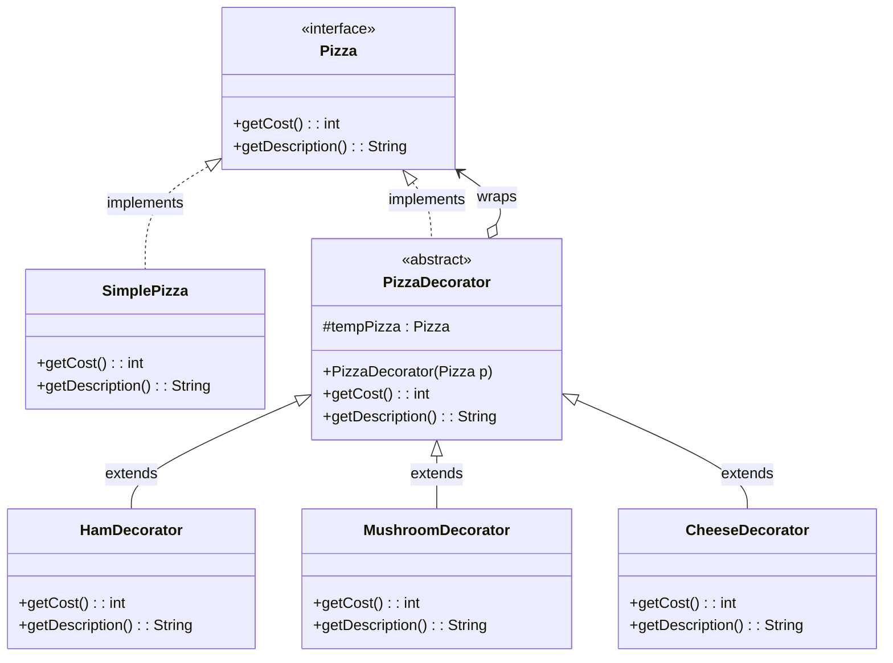
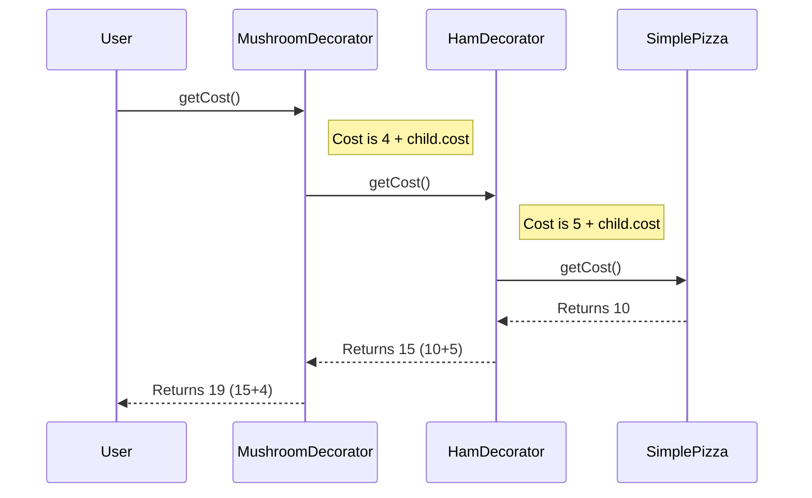

# Ex 1

The structure relies on a common interface (`OperationStrategy`) that all arithmetic operations must implement. The `CalculatorContext` interacts only with this interface, never directly with the specific math logic.

    public interface OperationStrategy {
        int execute(int a, int b);
    }

#### Strategy for Addition
    public class AdditionStrategy implements OperationStrategy
    {

        @Override
        public int execute(int a, int b) {
            return a + b;
        }
    }

###### Same for the rest of the operations

### The Context
This class allows us to swap the behavior dynamically. It doesn't know which math it is doing, it just delegates.

    public class CalculatorContext
    {
        private OperationStrategy strategy;

        // We can set or change the strategy at runtime
        public void setStrategy(OperationStrategy strategy) {
            this.strategy = strategy;
        }

        // The Context delegates the work to the Strategy
        public int executeStrategy(int a, int b) {
            if (strategy == null) {
                throw new IllegalStateException("Strategy not set");
            }
            return strategy.execute(a, b);
        }
    }

### The Client (Main Application)
This handles user input and decides which strategy to inject into the context.

    import java.util.Scanner;

    public class StrategyDemo {

        public static void main(String[] args) {
            Scanner scanner = new Scanner(System.in);
            CalculatorContext context = new CalculatorContext();

            // 1. Read Inputs
            System.out.print("Enter first number: ");
            int num1 = scanner.nextInt();
            
            System.out.print("Enter second number: ");
            int num2 = scanner.nextInt();
            
            System.out.print("Enter operation (+, -, *, /): ");
            String op = scanner.next();

            // 2. Decide Strategy (The "Switch")
            switch (op) {
                case "+":
                    context.setStrategy(new AdditionStrategy());
                    break;
                case "-":
                    context.setStrategy(new SubtractionStrategy());
                    break;
                case "*":
                    context.setStrategy(new MultiplicationStrategy());
                    break;
                case "/":
                    context.setStrategy(new DivisionStrategy());
                    break;
                default:
                    System.out.println("Invalid operation");
                    return;
            }

            // 3. Execute without knowing the specific logic
            int result = context.executeStrategy(num1, num2);
            System.out.println("Result: " + result);
        }
    }

# Ex 2

We need to refactor `Worker` and `SpecializedWorker` to remove duplicated code in the `makeStuff()` method. We apply the **Template Method Pattern**, defining the algorithm's skeleton in the parent class and letting the subclass override specific steps.

### Visual Design

The `Worker` class defines the structure. The `makeStuff()` method calls `updateX()` and `calculateZ()`. The parent provides default implementations, while the child overrides them to provide specialized logic.

## Execution Flow
When `makeStuff()` is called, the Parent class controls the flow, "dipping" into the Child class only for the specific steps that differ.

## The Template Class (Worker)

We move the common logic (printing and returning) here. We define `makeStuff` as `final` so the structure cannot be changed by subclasses.

    public class Worker {
        protected int x;

        public Worker(int _x) {
            x = _x;
        }

        // THE TEMPLATE METHOD
        // 'final' prevents subclasses from changing the algorithm's structure
        public final int makeStuff() {
            // Step 1: Varies (Hook)
            updateX();           
            
            // Step 2: Varies (Hook)
            int z = calculateZ(); 
            
            // Steps 3 & 4: Common Code (Duplication Removed)
            System.out.println("Values are:" + x + " and " + z);
            return x + z;
        }

        // Default implementation for Step 1
        protected void updateX() {
            x++;
        }

        // Default implementation for Step 2
        protected int calculateZ() {
            return x * x;
        }
    }

#### The Concrete Implementation (SpecializedWorker)

We remove the `makeStuff method` entirely. We only override the specific calculation steps that differ from the parent.

    public class SpecializedWorker extends Worker {
        private int y;

        public Specialized
    }

# Ex 4: Command Pattern

**Pattern Name:** Command Pattern

This pattern encapsulates a request as an object, thereby letting you parameterize clients with different requests (commands), queue or log requests, and support undoable operations. It decouples the object that invokes the operation (Remote Controller) from the one that knows how to perform it (TV, Media Player).

### Participants (General Case)

1.  **Command:** Declares an interface for executing an operation.
2.  **ConcreteCommand:** Defines a binding between a Receiver object and an action. It implements `execute()` by invoking the corresponding operation(s) on the Receiver.
3.  **Receiver:** Knows how to perform the operations associated with carrying out a request (e.g., The TV or Media Player).
4.  **Invoker:** Asks the command to carry out the request (e.g., The Remote Controller).
5.  **Client:** Creates a ConcreteCommand object and sets its receiver.

---

### Visual Design (UML)

The `RemoteControl` (Invoker) holds arrays of `Command` interfaces. It does not know about the `TV` or `MediaPlayer`. The `MacroCommand` is used for Slot 3 to trigger multiple devices at once.

### Execution Flow (Slot 3 Example)
Here is what happens when the user presses the "ON" button for Slot 3 (The Macro/Party Mode).

## Implementation Code
#### 1. Command Interface & Receivers
The basic building blocks. The Receivers are the existing hardware classes.

    // The Interface
    public interface Command {
        void execute();
    }

    // Receiver 1: TV
    public class TV {
        public void turnTVOn() {
            System.out.println("TV is now ON");
        }
        public void turnTVOff() {
            System.out.println("TV is now OFF");
        }
    }

    // Receiver 2: Media Player
    public class MediaPlayer {
        public void turnOn() {
            System.out.println("Media Player is ON");
        }
        public void turnOff() {
            System.out.println("Media Player is OFF");
        }
    }

#### 2. Concrete Commands
These wrap the receiver logic into the execute method.

    public class TVOnCommand implements Command {
        private TV tv;
        public TVOnCommand(TV tv) { this.tv = tv; }
        
        @Override
        public void execute() { tv.turnTVOn(); }
    }

    public class TVOffCommand implements Command {
        private TV tv;
        public TVOffCommand(TV tv) { this.tv = tv; }
        
        @Override
        public void execute() { tv.turnTVOff(); }
    }

    // ... Similar classes for MediaPlayer On/Off ...

    // The Macro Command (For Button 3)
    public class MacroCommand implements Command {
        private Command[] commands;

        public MacroCommand(Command[] commands) {
            this.commands = commands;
        }

        @Override
        public void execute() {
            for (Command c : commands) {
                c.execute();
            }
        }
    }

#### 3. The Invoker (Remote Controller)
It knows nothing about TVs or Media Players, only Commands.

    public class RemoteControl {
        private Command[] onCommands;
        private Command[] offCommands;

        public RemoteControl() {
            onCommands = new Command[3];
            offCommands = new Command[3];
        }

        public void setCommand(int slot, Command onCommand, Command offCommand) {
            onCommands[slot] = onCommand;
            offCommands[slot] = offCommand;
        }

        public void pushOnButton(int slot) {
            if (onCommands[slot] != null) {
                onCommands[slot].execute();
            }
        }

        public void pushOffButton(int slot) {
            if (offCommands[slot] != null) {
                offCommands[slot].execute();
            }
        }
    }

# Ex 6: Decorator Pattern

**Pattern Name:** Decorator Pattern

This pattern allows behavior to be added to an individual object, dynamically, without affecting the behavior of other objects from the same class. In this case, we wrap the `SimplePizza` with various `Ingredient` objects. Each wrapper adds its own cost and description to the result of the previous wrapper.

### Visual Design (UML)

The core idea is that `PizzaDecorator` **is a** Pizza (so it can be passed around) but it also **has a** Pizza (the object it is decorating).

## Execution Flow
Scenario: A user orders a Simple Pizza with Ham and Mushrooms. `Pizza p = new MushroomDecorator(new HamDecorator(new SimplePizza()));`

When we call `p.getCost()`, the call travels down the chain to the base pizza and bubbles back up, adding costs along the way.

#### Implementation Code
### 1. The Interface and Base Component
    // The Interface
    public interface Pizza {
        int getCost();
        String getDescription();
    }

    // The Base Implementation (Simple Pizza)
    public class SimplePizza implements Pizza {
        @Override
        public int getCost() {
            return 10;
        }

        @Override
        public String getDescription() {
            return "Simple Pizza (Ketchup, Mozzarella)";
        }
    }

### 2. The Abstract Decorator
This class standardizes how ingredients hold the reference to the "previous" pizza in the stack.

    public abstract class PizzaDecorator implements Pizza {
        // The wrapper holds a reference to the object it wraps
        protected Pizza tempPizza;

        public PizzaDecorator(Pizza newPizza) {
            tempPizza = newPizza;
        }

        public int getCost() {
            return tempPizza.getCost();
        }

        public String getDescription() {
            return tempPizza.getDescription();
        }
    }

### 3. Concrete Decorators (Ingredients)
These extend the abstract decorator and add their specific data.

    // Ingredient 1: Ham (Cost 5)
    public class HamDecorator extends PizzaDecorator {
        public HamDecorator(Pizza newPizza) {
            super(newPizza);
        }

        @Override
        public int getCost() {
            return tempPizza.getCost() + 5;
        }

        @Override
        public String getDescription() {
            return tempPizza.getDescription() + ", Ham";
        }
    }

    // Ingredient 2: Mushroom (Cost 4)
    public class MushroomDecorator extends PizzaDecorator {
        public MushroomDecorator(Pizza newPizza) {
            super(newPizza);
        }

        @Override
        public int getCost() {
            return tempPizza.getCost() + 4;
        }

        @Override
        public String getDescription() {
            return tempPizza.getDescription() + ", Mushroom";
        }
    }

### 4. Usage Example

    public class PizzaShop {
        public static void main(String[] args) {
            // 1. Order a Simple Pizza
            Pizza myPizza = new SimplePizza();
            
            // 2. Add Ham
            myPizza = new HamDecorator(myPizza);
            
            // 3. Add Mushrooms
            myPizza = new MushroomDecorator(myPizza);

            System.out.println("Order: " + myPizza.getDescription());
            System.out.println("Total Cost: " + myPizza.getCost() + " RON");
            
            // Output: 
            // Order: Simple Pizza (Ketchup, Mozzarella), Ham, Mushroom
            // Total Cost: 19 RON
        }
    }