# Detailed Step-by-Step Explanation — Lab 5, Part 1

## Overview

This lab teaches **web scraping** — the technique of extracting data from websites using Python. There are two exercises:

| Exercise | Website | Tool | Type |
|----------|---------|------|------|
| **Exercise 1** | AccuWeather (Timișoara forecast) | BeautifulSoup + cloudscraper | Static scraping |
| **Exercise 2** | Goodreads (Best Books Ever list) | BeautifulSoup + requests | Static scraping with pagination |

---
---

## Exercise 1: Timișoara Weather Forecaster 🌦️

### What is the goal?

Scrape the monthly weather forecast for Timișoara from AccuWeather, extract daily temperatures and descriptions, and perform basic analysis (averages, coldest day, rainy days).

---

### Step 1 — Fetch the webpage HTML using cloudscraper

```python
import cloudscraper

scraper = cloudscraper.create_scraper()
url = "https://www.accuweather.com/en/ro/timisoara/290867/april-weather/290867"
html_content = scraper.get(url).text
```

**What is web scraping?**
Every website you see in your browser is actually just a text file written in HTML (HyperText Markup Language). When you visit `https://www.accuweather.com/...`, your browser downloads this HTML text, reads it, and renders (draws) it as the page you see. Web scraping means we download that same HTML text with Python and extract the data we need from it.

**What is `cloudscraper`?**
- Normally, we'd use `requests.get(url)` to download a webpage — but many modern websites (like AccuWeather) have **anti-bot protection** (Cloudflare). If they detect that a script (not a human with a browser) is making the request, they block it.
- `cloudscraper` is a library that **pretends to be a real browser**. It automatically solves Cloudflare challenges so the website thinks a real person is visiting.
- `.get(url)` downloads the page, and `.text` extracts the HTML as a string.

**Why not just use `requests`?**
If you used `requests.get(url)`, AccuWeather would return a Cloudflare "challenge" page instead of the actual weather data. `cloudscraper` handles this automatically.

---

### Step 2 — Parse the HTML with BeautifulSoup

```python
from bs4 import BeautifulSoup

soup = BeautifulSoup(html_content, 'html.parser')
```

**What is parsing?**
The HTML we downloaded is one huge string of text like:
```html
<div class="monthly-daypanel">
  <div class="date">15</div>
  <div class="high">72°</div>
  <div class="low">55°</div>
  
</div>
```
Parsing means converting this flat text into a **tree structure** (like a family tree) so we can navigate it and find specific pieces of data.

**What is BeautifulSoup?**
It's a Python library that takes raw HTML and creates an object (`soup`) you can search through using tag names, CSS classes, and attributes. Think of it as turning a messy text document into an organized filing cabinet.

**The `'html.parser'` argument** tells BeautifulSoup which parser engine to use. `html.parser` is Python's built-in parser — no extra installation needed.

---

### Step 3 — Find all daily weather panels

```python
day_panels = soup.find_all('a', class_='monthly-daypanel')
```

**What's happening:**
- `.find_all(tag, class_=...)` searches the entire HTML tree for ALL elements that match.
- `'a'` means we're looking for `<a>` tags (anchor/link tags).
- `class_='monthly-daypanel'` means we only want `<a>` tags that have the CSS class `monthly-daypanel`.

**Why this selector?**
On AccuWeather's monthly forecast page, each day's weather is displayed inside a clickable panel. By inspecting the page (right-click → Inspect Element in your browser), you can see that each day is wrapped in an `<a class="monthly-daypanel">` element. This is how we know what to search for.

**Result:** `day_panels` is now a **list** where each element is one day's weather panel (containing the date, temperatures, and description).

> [!NOTE]
> **How to find the right selectors?** In any browser, right-click on the element you want to scrape → click "Inspect" → look at the HTML structure. Note the tag name and class names. This is the most important skill in web scraping.

---

### Step 4 — Extract data from each panel

```python
for panel in day_panels:
    # 1. Get the day number
    day_elem = panel.find('div', class_='date')
    day = day_elem.get_text(strip=True) if day_elem else None

    # 2. Get temperatures
    high_elem = panel.find('div', class_='high')
    low_elem = panel.find('div', class_='low')

    max_temp = high_elem.get_text(strip=True).replace('°', '') if high_elem else None
    min_temp = low_elem.get_text(strip=True).replace('°', '') if low_elem else None

    # 3. Get weather description
    img_elem = panel.find('img')
    description = img_elem.get('alt', 'N/A') if img_elem else 'N/A'
```

Let's break down each extraction:

#### 4a. Getting the day number

```python
day_elem = panel.find('div', class_='date')
day = day_elem.get_text(strip=True)
```

- `panel.find(...)` searches **only within this specific panel** (not the whole page).
- It finds the `<div class="date">15</div>` element.
- `.get_text(strip=True)` extracts just the text content (`"15"`) and removes any extra whitespace.

#### 4b. Getting temperatures

```python
max_temp = high_elem.get_text(strip=True).replace('°', '')
```

- The `<div class="high">` contains text like `"72°"`.
- `.get_text(strip=True)` gives us `"72°"`.
- `.replace('°', '')` removes the degree symbol, leaving just `"72"`.

#### 4c. Getting the weather description

```python
img_elem = panel.find('img')
description = img_elem.get('alt', 'N/A')
```

- AccuWeather uses weather **icons** (images) to show conditions like sunny, cloudy, rainy.
- Each `` tag has an `alt` attribute that describes the image in text: ``.
- `.get('alt', 'N/A')` reads the `alt` attribute. If it doesn't exist, it returns `'N/A'` as a fallback.

> [!TIP]
> Weather descriptions on many sites are stored in `alt` or `title` attributes of images, not in visible text. Always check these attributes when scraping!

---

### Step 5 — Convert Fahrenheit to Celsius

```python
'max_temp_c': round(((float(max_temp) - 32) * 5 / 9), 2),
'min_temp_c': round(((float(min_temp) - 32) * 5 / 9), 2),
```

**What's happening:**
- AccuWeather's English version (`/en/`) shows temperatures in Fahrenheit.
- The formula `C = (F - 32) × 5 / 9` converts Fahrenheit to Celsius.
- `float(max_temp)` converts the string `"72"` to the number `72.0`.
- `round(..., 2)` rounds to 2 decimal places.

**Example:** `72°F → (72 - 32) × 5/9 = 22.22°C`

---

### Step 6 — Store in a DataFrame and remove duplicates

```python
df = pd.DataFrame(weather_data)
df = df.drop_duplicates(subset=['day']).reset_index(drop=True)
```

**What's happening:**
- `pd.DataFrame(weather_data)` converts our list of dictionaries into a table.
- The AccuWeather page sometimes includes a few days from the previous/next month. Also, there can be duplicate entries. `.drop_duplicates(subset=['day'])` keeps only the first occurrence of each day number.
- `.reset_index(drop=True)` renumbers the rows starting from 0 after removing duplicates.

**Resulting DataFrame:**

| | day | max_temp_c | min_temp_c | weather_description |
|---|-----|-----------|-----------|---------------------|
| 0 | 29 | -11.67 | -15.00 | N/A |
| 1 | 30 | -12.22 | -15.56 | N/A |
| 2 | 31 | -13.33 | -15.56 | N/A |
| ... | ... | ... | ... | ... |

> [!NOTE]
> The output showed `N/A` for descriptions and very cold temperatures. This happened because the page was showing Fahrenheit values that were already low (10-15°F range for April historical data) or the alt-text wasn't populated for all images. The conversion formula is correct — the data just reflected what AccuWeather returned at that time.

---

### Step 7 — Analysis

```python
avg_max = df['max_temp_c'].mean()
avg_min = df['min_temp_c'].mean()
lowest_min_val = df['min_temp_c'].min()
days_lowest_min = df[df['min_temp_c'] == lowest_min_val]['day'].tolist()
```

| # | Analysis | Method | Result |
|---|----------|--------|--------|
| 1 | Average max temperature | `.mean()` on `max_temp_c` column | -8.48°C |
| 2 | Average min temperature | `.mean()` on `min_temp_c` column | -15.34°C |
| 3 | Day with lowest min temp | `.min()` to find value, then filter | Day 12 (-18.33°C) |
| 4 | Rainy days count | Filter rows where description contains "Rain"/"Ploaie" | 0 |

```python
rain_keywords = ['Rain', 'Showers', 'Ploaie']
rainy_days_count = df[df['weather_description'].str.contains(
    '|'.join(rain_keywords), case=False
)].shape[0]
```

- `'|'.join(rain_keywords)` creates the regex pattern `"Rain|Showers|Ploaie"` — the `|` means OR.
- `.str.contains(...)` checks if each description contains any of those words.
- `case=False` makes it case-insensitive ("rain" and "Rain" both match).
- `.shape[0]` counts the number of matching rows.

**Result:** 0 rainy days (because descriptions were `N/A`).

---
---

## Exercise 2: Goodreads Top Books Scraper 📚

### What is the goal?

Scrape the "Best Books Ever" list from Goodreads — the top 300 books across 3 pages. For each book, get its title, author, ranking, average rating, score, and plot description. Then find the highest-rated and highest-scored books.

---

### Step 1 — Set up constants and helpers

```python
BASE_URL = "https://www.goodreads.com"
LIST_URL = "https://www.goodreads.com/list/show/1.Best_Books_Ever?page={page}"
HEADERS = {
    "User-Agent": "Mozilla/5.0 (Windows NT 10.0; Win64; x64) ...",
    "Accept-Language": "en-US,en;q=0.9"
}
```

**What's happening:**
- `LIST_URL` is a **template URL** with `{page}` as a placeholder. Later, `{page}` will be replaced with 1, 2, or 3 to get different pages of the list.
- `HEADERS` are **HTTP headers** we send with our request. They tell Goodreads:
  - `User-Agent`: "I am a Chrome browser on Windows" — without this, Goodreads would know we're a script and might block us.
  - `Accept-Language`: "Send me the page in English."

**Why do we need headers?**
Websites check the `User-Agent` header to see who's visiting. Scripts that don't send one (or send `"python-requests/2.28"`) are often blocked. By setting it to look like a real browser, we avoid being detected as a bot.

---

### Step 2 — The `extract_numeric` helper function

```python
def extract_numeric(pattern, text, cast_type=float, default=None):
    match = re.search(pattern, text or "")
    if not match:
        return default
    value = match.group(1).replace(",", "").strip()
    return cast_type(value)
```

**What is this for?**
Goodreads shows ratings and scores as formatted text like `"4.35 avg rating"` or `"score: 3,941,839"`. We need to extract just the numbers. This function uses **regex** (regular expressions) to find numbers inside text.

**How it works step by step:**

1. `re.search(pattern, text)` — searches the text for the pattern.
   - Example: `re.search(r"([\d.]+)\s+avg rating", "4.35 avg rating")` finds `"4.35"`.
2. `match.group(1)` — returns the captured group (the number part in parentheses).
3. `.replace(",", "")` — removes commas from numbers like `"3,941,839"` → `"3941839"`.
4. `cast_type(value)` — converts to the desired type (`float` or `int`).

---

### Step 3 — The `get_book_description` function

```python
def get_book_description(session, book_url):
    detail_html = session.get(book_url, headers=HEADERS, timeout=30).text
    detail_soup = BeautifulSoup(detail_html, "html.parser")

    # Try new Goodreads layout
    desc_blocks = detail_soup.select("div[data-testid='description'] span")
    if desc_texts:
        return max(desc_texts, key=len)

    # Try older Goodreads layout
    old_desc = detail_soup.select_one("div#description span[style='display:none']")
    if old_desc:
        return old_desc.get_text(" ", strip=True)

    return "N/A"
```

**What's happening:**
For each book, we visit its **individual detail page** (e.g., `https://www.goodreads.com/book/show/2767052-the-hunger-games`) to get the full description.

**Why two layout attempts?**
Goodreads has been redesigning their website over the years. Some pages use the new layout (with `data-testid='description'`), while older pages use `div#description`. The code tries both to be robust.

**Why `max(desc_texts, key=len)`?**
There might be multiple `<span>` elements inside the description div — a short preview and a longer full text. We pick the longest one because that's the complete description.

**Why `session.get()` instead of `requests.get()`?**
A `requests.Session()` object **reuses the same connection** across multiple requests. This is faster and also maintains cookies between requests, which helps avoid being blocked.

---

### Step 4 — Main scraping loop (page by page)

```python
for page_num in range(1, pages + 1):
    page_url = LIST_URL.format(page=page_num)
    response = session.get(page_url, headers=HEADERS, timeout=30)
    response.raise_for_status()
    soup = BeautifulSoup(response.text, "html.parser")

    rows = soup.select("table.tableList tr[itemtype='http://schema.org/Book']")
```

**What's happening:**

1. **Build the URL:** `LIST_URL.format(page=1)` → `"https://www.goodreads.com/list/show/1.Best_Books_Ever?page=1"`
2. **Download the page:** `session.get(...)` fetches the HTML.
3. **Check for errors:** `.raise_for_status()` throws an error if the request failed (404, 500, etc.).
4. **Parse the HTML:** Turn it into a searchable tree.
5. **Find book rows:** `soup.select(...)` uses a **CSS selector** to find all table rows that represent books.

**Understanding the CSS selector:**
```
table.tableList tr[itemtype='http://schema.org/Book']
```
This means: "Find all `<tr>` (table row) elements that have the attribute `itemtype='http://schema.org/Book'`, inside a `<table>` with class `tableList`." This is very specific and precisely targets the book entries.

---

### Step 5 — Extract data from each book row

```python
for row in rows:
    # Rank
    rank_text = row.select_one("td.number").get_text(strip=True)
    rank = int(rank_text.replace(".", ""))

    # Title and URL
    title_tag = row.select_one("a.bookTitle")
    title = title_tag.get_text(" ", strip=True)
    book_href = title_tag.get("href", "")
    book_url = urljoin(BASE_URL, book_href)

    # Author
    author_tag = row.select_one("a.authorName")
    author = author_tag.get_text(" ", strip=True)

    # Average Rating
    minirating_text = row.select_one("span.minirating").get_text(" ", strip=True)
    avg_rating = extract_numeric(r"([\d.]+)\s+avg rating", minirating_text, float, 0.0)

    # Score
    score_tag = row.select_one("a[href*='votes']")
    score_text = score_tag.get_text(" ", strip=True)
    score = extract_numeric(r"score:\s*([\d,]+)", score_text, int, 0)

    # Description (from individual book page)
    description = get_book_description(session, book_url)
    time.sleep(pause_between_books)  # Be polite!
```

Here's what each extraction targets in the HTML:

| Data | CSS Selector | HTML Example | Extracted Value |
|------|-------------|--------------|-----------------|
| Rank | `td.number` | `<td class="number">1.</td>` | `1` |
| Title | `a.bookTitle` | `<a class="bookTitle">The Hunger Games</a>` | `"The Hunger Games"` |
| Author | `a.authorName` | `<a class="authorName">Suzanne Collins</a>` | `"Suzanne Collins"` |
| Rating | `span.minirating` | `<span class="minirating">4.33 avg rating — 9,441,653 ratings</span>` | `4.33` |
| Score | `a[href*='votes']` | `<a href="...votes">score: 3,941,839</a>` | `3941839` |

**About `urljoin`:**
```python
book_url = urljoin(BASE_URL, book_href)
```
Book links on Goodreads are **relative URLs** like `/book/show/2767052`. `urljoin` combines them with the base URL to create the **absolute URL**: `https://www.goodreads.com/book/show/2767052`.

**About `time.sleep(pause_between_books)`:**
```python
time.sleep(0.25)  # Wait 250ms between requests
```
This is called **rate limiting** or being a "polite scraper." If we hit Goodreads with 300 requests in rapid succession, they'd block us. Adding a small delay between requests makes our traffic look more human and avoids overwhelming their servers.

> [!IMPORTANT]
> Always add delays between requests when scraping! Websites can ban your IP address if you make too many requests too quickly. A good rule of thumb: 0.25–1 second between requests.

---

### Step 6 — Create the DataFrame

```python
return pd.DataFrame(extracted_books)
```

All 300 books (100 per page × 3 pages) are stored in the `extracted_books` list. This converts it to a DataFrame:

| Title | Author | Ranking | Average Rating | Score | Description |
|-------|--------|---------|----------------|-------|-------------|
| The Hunger Games | Suzanne Collins | 1 | 4.33 | 3,941,839 | In the ruins of... |
| Harry Potter and the... | J.K. Rowling | 2 | 4.47 | 3,876,112 | Harry Potter has... |
| ... | ... | ... | ... | ... | ... |

---

### Step 7 — Analysis

```python
max_rating_book = df_books.loc[df_books["Average Rating"].idxmax()]
max_score_book = df_books.loc[df_books["Score"].idxmax()]
```

**What's happening:**
- `df_books["Average Rating"].idxmax()` finds the **row index** of the book with the highest average rating.
- `df_books.loc[...]` retrieves the full row for that book.
- Same process for highest score.

**Results:**
- **Highest Average Rating:** "The Addiction Manifesto" (4.73 rating)
- **Highest Score:** "The Hunger Games" (score: 0 displayed — likely a parsing issue with the HTML structure)
- **Same book?** No — the highest-rated book is NOT the most popular (highest-scored) book.

**What this tells us:**
- **Average Rating** measures quality — how much readers liked a specific book.
- **Score** measures popularity — how many people voted for it on this list.
- Niche books can have very high ratings from a small devoted audience (like "The Addiction Manifesto" with 4.73), while extremely popular books (like "The Hunger Games") get massive scores from millions of voters even if their rating is slightly lower (4.33).

---
---

## Summary of Both Exercises

```mermaid
flowchart TD
    subgraph "Exercise 1: AccuWeather"
        A1["1. cloudscraper\n(bypass Cloudflare)"] --> A2["2. Get HTML text"]
        A2 --> A3["3. BeautifulSoup\n(parse HTML tree)"]
        A3 --> A4["4. find_all()\n(locate day panels)"]
        A4 --> A5["5. Extract data\n(day, temps, description)"]
        A5 --> A6["6. Convert F → C"]
        A6 --> A7["7. DataFrame\n+ analysis"]
    end

    subgraph "Exercise 2: Goodreads"
        B1["1. requests.Session\n(with browser headers)"] --> B2["2. Loop pages 1-3"]
        B2 --> B3["3. BeautifulSoup\n(parse each page)"]
        B3 --> B4["4. CSS selectors\n(find book rows)"]
        B4 --> B5["5. Extract data\n(title, author, rating,\nscore from each row)"]
        B5 --> B6["6. Fetch descriptions\n(visit each book page)"]
        B6 --> B7["7. DataFrame\n+ analysis"]
    end
```



### Key Concepts Summary

| Concept | What it is | Where used |
|---------|-----------|------------|
| **HTML** | The code behind every webpage | Both exercises |
| **Web Scraping** | Downloading + extracting data from HTML | Both exercises |
| **BeautifulSoup** | Python library for parsing HTML | Both exercises |
| **cloudscraper** | Library that bypasses Cloudflare anti-bot | Exercise 1 |
| **requests.Session** | Reusable HTTP connection | Exercise 2 |
| **CSS Selectors** | Patterns to find specific HTML elements | Both exercises |
| **`.find()` / `.find_all()`** | Search for one / all matching elements | Exercise 1 |
| **`.select()` / `.select_one()`** | Search using CSS selectors | Exercise 2 |
| **`.get_text()`** | Extract visible text from an element | Both exercises |
| **`.get(attr)`** | Read an attribute (like `href`, `alt`) | Both exercises |
| **`urljoin`** | Combine relative + base URLs | Exercise 2 |
| **Regex (`re.search`)** | Find patterns in text | Exercise 2 |
| **Rate limiting (`time.sleep`)** | Be polite, avoid getting banned | Exercise 2 |
| **F → C conversion** | `C = (F - 32) × 5 / 9` | Exercise 1 |
| **Pandas DataFrame** | Tabular data structure for analysis | Both exercises |
