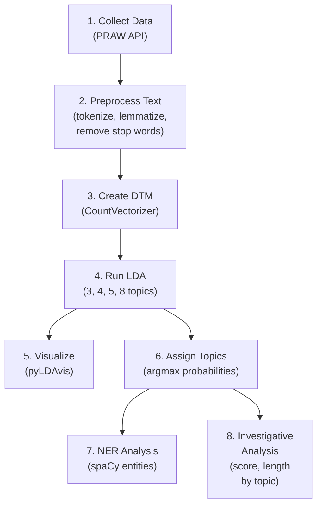

# Detailed Step-by-Step Explanation of Exercises 3 & 4

---

## Exercise 3: Subreddit Engagement Analysis

### What is the goal?

We want to answer: **"Is there a relationship between how many upvotes a post gets and how many comments it receives?"** We also want to find the **most common words** in post titles.

---

### Step 1 — Connect to Reddit using PRAW

```python
subreddit = reddit.subreddit('technology')
post_iterator = subreddit.top(time_filter='all', limit=100)
```

**What's happening:**
- `reddit` is an object created earlier in the notebook using the PRAW library. It's our "connection" to Reddit's API (Application Programming Interface). An API is a way for our code to talk to Reddit's servers and ask for data.
- `reddit.subreddit('technology')` tells the API: "I want data from the r/technology subreddit."
- `.top(time_filter='all', limit=100)` says: "Give me the top 100 most upvoted posts of ALL TIME from this subreddit."
- The result (`post_iterator`) is like a list of posts that we can loop through.

**Why:**
We need actual data to analyze. Reddit's API gives us structured data (title, score, number of comments, etc.) for each post without needing to scrape HTML.

---

### Step 2 — Store the data in a Pandas DataFrame

```python
for post in post_iterator:
    posts_data.append([
        post.title, post.score, post.id, post.subreddit.display_name,
        post.url, post.num_comments, post.selftext, post_time
    ])

posts_df = pd.DataFrame(posts_data, columns=[
    'title', 'score', 'id', 'subreddit', 'url', 'num_comments', 'body', 'created_time'
])
```

**What's happening:**
- We loop through each post and extract its properties: `title` (the headline), `score` (upvotes minus downvotes), `num_comments` (how many comments it has), etc.
- Each post's data is added as a row to a list called `posts_data`.
- `pd.DataFrame(...)` converts that list into a **DataFrame** — think of it as a spreadsheet/table in Python. Each column has a name, each row is one post.

**Why:**
DataFrames make it very easy to sort, filter, and calculate statistics on tabular data. It's the standard tool for data analysis in Python.

---

### Step 3 — Sort and compare top vs. bottom posts

```python
posts_df_sorted = posts_df.sort_values('score', ascending=False)
top10 = posts_df_sorted.head(10)
bottom10 = posts_df_sorted.tail(10)

avg_score_top = top10['score'].mean()
avg_comments_top = top10['num_comments'].mean()
```

**What's happening:**
- `.sort_values('score', ascending=False)` sorts all 100 posts by their score, highest first.
- `.head(10)` takes the first 10 rows (= the 10 highest-scored posts).
- `.tail(10)` takes the last 10 rows (= the 10 lowest-scored posts within our sample).
- `.mean()` calculates the average of a column.

**What we found:**
- Top 10 posts: avg score **133,823**, avg comments **5,323**
- Bottom 10 posts: avg score **77,955**, avg comments **3,232**

**What this tells us:**
Higher-scored posts tend to also have more comments — there IS a positive correlation. But it's not perfect. Some viral posts (images/links) get massive upvotes but few comments, while controversial discussion posts might have moderate scores but thousands of comments.

---

### Step 4 — Extract and count keywords from titles

```python
all_titles = ' '.join(posts_df['title'].tolist())  # combine all titles into one big string
tokens = all_titles.split()                         # split into individual words
tokens = [t.lower() for t in tokens]                # make everything lowercase
```

**What's happening:**
- We take ALL 100 post titles and glue them together into one long string.
- `.split()` breaks that string into individual words (called **tokens**). For example, `"Hello World"` becomes `["Hello", "World"]`.
- We convert everything to lowercase so that "Reddit" and "reddit" count as the same word.

```python
stop_words_en = set(stopwords.words('english'))
filtered_tokens = [
    t for t in tokens
    if t.isalpha() and len(t) >= 3 and t not in all_stopwords
]
```

**What's happening:**
- **Stop words** are common words like "the", "a", "is", "in", "and" that appear everywhere but don't carry meaning. NLTK provides a built-in list of these.
- We filter out: (1) non-alphabetic tokens (numbers, punctuation), (2) words shorter than 3 characters, (3) stop words.
- What remains are the **meaningful content words** from the titles.

```python
word_freq = Counter(filtered_tokens)
top_10_words = word_freq.most_common(10)
```

**What's happening:**
- `Counter` counts how many times each word appears. For example: `{"fcc": 15, "reddit": 13, "net": 12, ...}`
- `.most_common(10)` returns the 10 most frequent words.

**Result:** The top words were `fcc (15)`, `reddit (13)`, `net (12)`, `neutrality (10)` — which makes sense because r/technology's most upvoted posts of all time were largely about net neutrality and FCC regulations.

---

### Step 5 — Plot a bar chart

```python
plt.bar(words, counts, color='steelblue', edgecolor='black')
plt.xlabel('Word')
plt.ylabel('Frequency')
plt.title('Top 10 Most Frequent Words...')
plt.show()
```

**What's happening:**
- `matplotlib` is Python's main plotting library.
- `plt.bar(...)` creates a bar chart where each bar represents one word and its height is the frequency.
- Labels and title are added for clarity.
- `plt.show()` renders the chart.

---
---

## Exercise 4: Deep Dive into Reddit Discussions

### What is the goal?

This is a full **Natural Language Processing (NLP) pipeline**. We want to:
1. Collect hundreds of comments from 4 different subreddits
2. Clean and preprocess the text
3. Discover hidden "topics" using **LDA** (Latent Dirichlet Allocation)
4. Visualize those topics interactively
5. Assign each comment to its dominant topic
6. Extract named entities (people, organizations, places) using **NER**
7. Perform an additional investigative analysis

---

### Task 1 — Automatically find and collect comments

```python
subreddit_names = ['AskReddit', 'technology', 'worldnews', 'gaming']

for sub_name in subreddit_names:
    subreddit = reddit.subreddit(sub_name)
    for post in subreddit.top(time_filter='month', limit=5):
        if post.num_comments >= 50:
            comments = fetch_comments(reddit, post.id, max_comments=200)
            break
```

**What's happening:**
- We define 4 subreddits we want to analyze.
- For each subreddit, we look at the **top 5 posts of the current month**.
- We pick the **first post that has at least 50 comments** (to ensure we have enough data).
- We then call `fetch_comments()` to collect up to 200 comments from that post.

**Inside `fetch_comments()`:**
```python
submission.comments.replace_more(limit=10)
for comment in submission.comments.list():
    if len(collected) >= max_comments:
        break
    collected.append({...comment data...})
```

- `replace_more(limit=10)` — Reddit doesn't send all comments at once. It sends placeholders that say "click to load more." This line "clicks" those buttons (up to 10 of them) to reveal hidden comment trees. Each "click" is a separate API request, which is why this can be slow.
- `submission.comments.list()` gives a flat list of ALL comments (including replies to replies).
- We collect each comment's ID, subreddit, post title, body text, score, and timestamp.

**Result:** We collected **~800 total comments** across 4 posts from 4 different communities.

---

### Task 2 — Preprocess the text

**Why preprocess?**
Raw Reddit comments are messy: they have URLs, punctuation, different word forms ("running" vs "run"), and meaningless common words. LDA works much better on clean, normalized text.

```python
def preprocess_text(text):
    text = text.lower()                                          # 1
    text = re.sub(r'http\S+|www\S+|https\S+', '', text)         # 2
    text = text.translate(str.maketrans('', '', punctuation))    # 3
    tokens = word_tokenize(text)                                 # 4
    pos_tags = nltk.pos_tag(tokens)                              # 5
    lemmatized = [lemmatizer.lemmatize(word, pos=...) ...]       # 6
    return ' '.join(lemmatized)                                  # 7
```

Here's what each step does:

| # | Operation | Example | Why |
|---|-----------|---------|-----|
| 1 | **Lowercase** | `"GREAT Game!"` → `"great game!"` | So "Great" and "great" count as same word |
| 2 | **Remove URLs** | `"check https://example.com out"` → `"check  out"` | URLs are noise, not content |
| 3 | **Remove punctuation & digits** | `"hello, world! 123"` → `"hello world"` | Punctuation doesn't help topic modeling |
| 4 | **Tokenize** | `"hello world"` → `["hello", "world"]` | Split text into individual words |
| 5 | **POS tag** | `["hello", "world"]` → `[("hello", "NN"), ("world", "NN")]` | Identify if word is noun, verb, adjective, etc. |
| 6 | **Lemmatize** | `"running"` → `"run"`, `"better"` → `"good"` | Reduce words to base form (using POS to be accurate) |
| 7 | **Rejoin** | `["hello", "world"]` → `"hello world"` | Convert back to string for the vectorizer |

> [!NOTE]
> **Lemmatization vs Stemming:** Stemming just chops off word endings (`"studies"` → `"studi"`), which can create non-words. Lemmatization uses a dictionary to find the actual root word (`"studies"` → `"study"`), producing real words that are easier to interpret.

After preprocessing, empty or deleted comments are removed.

---

### Task 3 — LDA Topic Modeling

#### 3a. Create a Document-Term Matrix (DTM)

```python
vectorizer = CountVectorizer(max_df=0.85, min_df=5)
dtm = vectorizer.fit_transform(comments_df['ProcessedBody'])
```

**What is a DTM?**
Imagine a giant spreadsheet where:
- Each **row** is one comment
- Each **column** is one unique word from the entire corpus
- Each **cell** contains how many times that word appears in that comment

For example:

| | "game" | "price" | "israel" | "pope" |
|---|--------|---------|----------|--------|
| Comment 1 | 3 | 0 | 0 | 0 |
| Comment 2 | 0 | 2 | 1 | 0 |
| Comment 3 | 0 | 0 | 0 | 4 |

**Parameters:**
- `max_df=0.85` — ignore words that appear in more than 85% of comments (too common, like stop words)
- `min_df=5` — ignore words that appear in fewer than 5 comments (too rare to form patterns)

**Our DTM:** 786 documents × hundreds of unique terms.

#### 3b. Fit LDA models

```python
for n_topics in [3, 4, 5, 8]:
    lda = LatentDirichletAllocation(n_components=n_topics, random_state=42)
    lda.fit(dtm)
```

**What is LDA?**
LDA (Latent Dirichlet Allocation) is an **unsupervised machine learning algorithm** that:
1. Assumes each **document** (comment) is a mixture of several **topics**
2. Assumes each **topic** is a mixture of several **words**
3. Tries to figure out both mixtures simultaneously

Think of it like this: if you dumped a pile of mixed LEGO bricks on a table, LDA tries to figure out which bricks belong to which model.

**Why multiple topic counts?**
We don't know in advance how many topics exist. So we try 3, 4, 5, and 8 topics and compare the results. Since we have 4 subreddits, we expect **4 topics** to work best — each topic roughly corresponding to one subreddit's discussion theme.

**For each model, we print the top 15 words per topic:**
```
Topic #0: israel | time | military | country | aid | pull | dollar ...
Topic #1: pope | church | catholic | generation | world ...
Topic #2: game | console | price | playstation | launch ...
Topic #3: sam | altman | chatgpt | risotto | model | recipe ...
```

You can see each topic has a clear theme!

---

### Task 4 — pyLDAvis Visualization

```python
vis_data = pyLDAvis.lda_model.prepare(chosen_lda, dtm, vectorizer)
display(vis_data)
```

**What is pyLDAvis?**
It's a library that creates an **interactive visualization** of the LDA results. It shows:

- **Left panel:** Circles representing each topic. The **size** of each circle shows how prevalent that topic is. The **distance** between circles shows how different the topics are from each other.
- **Right panel:** When you click a topic circle, it shows the most important words for that topic as a bar chart.

We chose the 4-topic model because our data comes from 4 subreddits, so we expect 4 distinct themes.

**The compatibility patch:**
```python
if hasattr(vectorizer, 'get_feature_names_out') and not hasattr(vectorizer, 'get_feature_names'):
    fn = vectorizer.get_feature_names_out()
    vectorizer.get_feature_names = lambda: fn
```
Newer versions of scikit-learn renamed `get_feature_names()` to `get_feature_names_out()`, but pyLDAvis still calls the old name. This patch makes them compatible.

---

### Task 5 — Assign Dominant Topic to Each Comment

```python
doc_topic_dist = chosen_lda.transform(dtm)    # Get probability distribution
comments_df['DominantTopic'] = np.argmax(doc_topic_dist, axis=1)
```

**What's happening:**
- `lda.transform(dtm)` gives us, for each comment, the **probability** that it belongs to each topic.
  - Example: Comment #1 → `[0.15, 0.05, 0.70, 0.10]` means 70% Topic 2, 15% Topic 0, etc.
- `np.argmax(..., axis=1)` picks the topic with the **highest probability** for each comment.
  - For Comment #1 above, it would return `2` (Topic #2).

**Then we aggregate per post:**
```python
post_topic_summary = comments_df.groupby('PostTitle')['DominantTopic'].agg(
    lambda x: x.value_counts().index[0]
)
```
This groups comments by which post they came from, then finds which topic appears most often among that post's comments. That becomes the post's "overall dominant topic."

**Results:**
- AskReddit ("US president pulling support from Israel") → Topic #2 (Israel/politics words)
- technology ("Sam Altman's Home / ChatGPT Risotto") → Topic #3 (AI/tech words)
- gaming ("PlayStation Console Prices") → Topic #0 (gaming/price words)
- worldnews ("Pope: World ravaged by tyrants") → Topic #0 (also general/world words)

---

### Task 6 — Named Entity Recognition (NER)

```python
nlp = spacy.load("en_core_web_sm")
for text in sample_texts:
    doc = nlp(text[:1000])
    for ent in doc.ents:
        if ent.label_ in {'PERSON', 'ORG', 'GPE', 'PRODUCT', 'EVENT'}:
            entity_counter[(ent.text.strip(), ent.label_)] += 1
```

**What is NER?**
NER (Named Entity Recognition) is an NLP technique that automatically identifies **real-world entities** in text:

| Entity Type | Code | Examples |
|-------------|------|----------|
| Person | `PERSON` | Netanyahu, Trump, Sam Altman |
| Organization | `ORG` | AIPAC, Congress, Sony |
| Country/City | `GPE` | Israel, US, Iran, Egypt |
| Product | `PRODUCT` | PlayStation, ChatGPT |
| Event | `EVENT` | — |

**How it works:**
- `spacy.load("en_core_web_sm")` loads a pre-trained English language model. This model was trained on millions of text samples and "knows" what names, places, and organizations look like.
- `nlp(text)` processes a comment and identifies all entities.
- We count how many times each entity appears across all comments.
- We only keep entity types we care about (PERSON, ORG, GPE, PRODUCT, EVENT).

**Results:**
The top entities were: **Israel (GPE): 93**, **US (GPE): 37**, **Iran (GPE): 9**, **Netanyahu (PERSON): 7**, **Trump (PERSON): 4** — which perfectly reflects the content of the AskReddit and worldnews discussions.

> [!NOTE]
> NER isn't perfect. For example, "AI" was classified as GPE (location) and "Risotto" was classified as GPE — these are errors from the small language model. A larger model like `en_core_web_lg` would be more accurate.

---

### Task 7 — Investigative Analysis

We chose to analyze: **How do comment score and comment length vary across topics?**

```python
comments_df['CommentLength'] = comments_df['CommentBody'].apply(len)

analysis = comments_df.groupby('DominantTopic').agg(
    AvgScore=('Score', 'mean'),
    AvgLength=('CommentLength', 'mean'),
    CommentCount=('CommentID', 'count')
)
```

**What's happening:**
- `.apply(len)` calculates the character count of each comment body.
- `.groupby('DominantTopic')` groups comments by their assigned topic.
- `.agg(...)` calculates the **average score**, **average length**, and **count** for each group.

**Results:**

| Topic | Avg Score | Avg Length (chars) | Comment Count |
|-------|-----------|-------------------|---------------|
| 0 | 189.9 | 103.3 | 273 |
| 1 | 288.3 | 102.1 | 158 |
| 2 | 220.2 | **211.7** | 182 |
| 3 | 203.9 | 117.8 | 173 |

**What this tells us:**
- Topic 2 (Israel/politics from AskReddit) has significantly **longer comments** (212 chars vs ~100 chars for others) — people write more when discussing political/controversial topics.
- Topic 1 has the **highest average score** (288) — worldnews/pope comments were more upvoted.

**Topic prevalence per subreddit (stacked bar chart):**
```python
prevalence = comments_df.groupby(['Subreddit', 'DominantTopic']).size().unstack(fill_value=0)
prevalence_pct = prevalence.div(prevalence.sum(axis=1), axis=0) * 100
prevalence_pct.plot(kind='bar', stacked=True)
```

This creates a **stacked bar chart** showing what percentage of each subreddit's comments fall into each topic. Ideally, each subreddit should be dominated by one topic — and that's exactly what we see, confirming that LDA successfully separated the 4 communities' discussions into distinct themes.

---

## Summary of the Complete Pipeline


